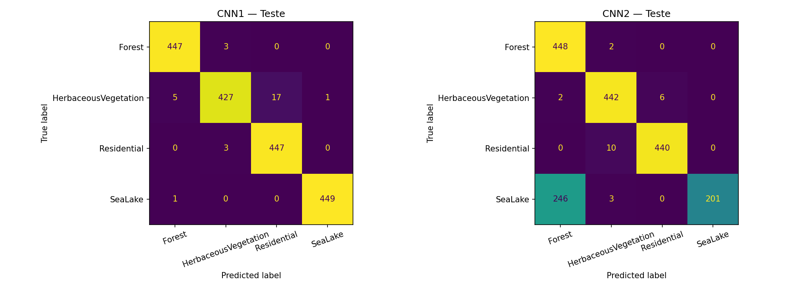
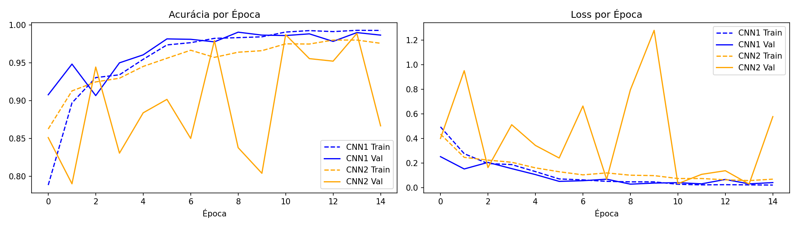

# 🛰️ OrbitWatch — Classificação de Cobertura de Solo via CNN

**Global Solution 2026 · FIAP · Applied Computer Vision**

---

## 👥 Integrantes

| Nome | RM |
|------|----|
| Guilherme Rezende Bezerra | RM 98508 |
| Matheus Brisqui | RM 97892 |
| Gustavo Brisqui | RM 97969 |

---

## 📌 Definição do Problema

No contexto do OrbitWatch — plataforma de monitoramento de queimadas — é essencial identificar o tipo de cobertura de solo afetado por um foco de incêndio. Saber se a área é floresta, vegetação rasteira, área residencial ou corpo d'água determina o nível de urgência da resposta e o órgão responsável pelo atendimento.

Este projeto utiliza **Visão Computacional** para classificar imagens satelitais do satélite Sentinel-2 (ESA) em 4 categorias relevantes para o monitoramento ambiental, contribuindo diretamente com a camada de análise visual do OrbitWatch.

---

## 🗂️ Dataset

- **Fonte:** [EuroSAT](https://github.com/phelber/EuroSAT) — imagens do satélite Sentinel-2 (ESA)
- **Classes utilizadas (4):**

| Classe | Descrição |
|--------|-----------|
| `Forest` | Área de floresta — maior risco de queimada |
| `HerbaceousVegetation` | Vegetação rasteira — segundo maior risco |
| `Residential` | Área residencial — impacto humano direto |
| `SeaLake` | Água — referência negativa (sem risco) |

- **Total de imagens:** 12.000 (3.000 por classe)
- **Resolução:** 64×64 pixels (RGB)
- **Divisão:**

| Split | Imagens |
|-------|---------|
| Treino | 8.400 (70%) |
| Validação | 1.800 (15%) |
| Teste | 1.800 (15%) |

---

## 🧠 Arquiteturas CNN

### CNN1 — Arquitetura Simples
- 3 blocos convolucionais (Conv → ReLU → MaxPool)
- Canais: 32 → 64 → 128
- Classificador: Linear(8192, 256) → Dropout(0.5) → Linear(256, 4)
- **2.191.684 parâmetros**

### CNN2 — Arquitetura Profunda com BatchNorm
- 4 blocos convolucionais (Conv → BatchNorm → ReLU → MaxPool)
- Canais: 32 → 64 → 128 → 256
- Classificador: Linear(4096, 512) → Dropout(0.5) → Linear(512, 4)
- **2.489.092 parâmetros**

---

## 📊 Resultados

### Acurácia no Conjunto de Teste

| Modelo | Acurácia | F1-Score (macro) |
|--------|----------|-----------------|
| **CNN1** | **98%** | **0.98** |
| CNN2 | 85% | 0.84 |

### Matriz de Confusão


### Curvas de Treino


---

## 🔍 Análise Técnica

**CNN1 foi superior** por três razões:

1. **Estabilidade de validação:** CNN1 convergiu suavemente, enquanto CNN2 oscilou entre 79% e 98% ao longo das épocas — sinal claro de instabilidade no treinamento.

2. **Colapso da CNN2 em SeaLake:** A CNN2 confundiu 246 imagens de água com floresta (recall de apenas 45% na classe SeaLake). A profundidade extra sem ajuste de learning rate causou underfitting nessa classe.

3. **BatchNorm não ajudou aqui:** Com imagens pequenas (64×64) e poucas classes, o BatchNorm adicionou ruído em vez de regularizar — a CNN1 mais simples generalizou melhor.

---

## 🚀 Como Executar

### Pré-requisitos
```bash
pip install -r requirements.txt
```

### Rodar o Notebook
Abra `OrbitWatch.ipynb` no Jupyter ou Google Colab e execute todas as células em ordem.

> ⚠️ Recomenda-se usar GPU (Google Colab T4 ou equivalente) para o treinamento.

### Demo com Gradio
A última célula do notebook sobe automaticamente a interface de classificação. Envie qualquer imagem satelital 64×64 para obter a predição.

---

## 📁 Estrutura do Repositório

```
orbitwatch-acv/
├── OrbitWatch.ipynb           # Notebook completo de treinamento
├── cnn1_best.pth              # Pesos do melhor modelo (CNN1)
├── confusion_matrix_cnn.png   # Matrizes de confusão
├── training_curves.png        # Curvas de acurácia e loss
├── requirements.txt           # Dependências
└── README.md                  # Este arquivo
```

---

## 🔗 Conexão com a Indústria Espacial

As imagens utilizadas são capturadas pelo satélite **Sentinel-2 da ESA (Agência Espacial Europeia)** em órbita a 786 km de altitude. O modelo treinado transforma essa telemetria orbital em inteligência aplicada: identificar automaticamente o tipo de cobertura de solo em regiões com focos de calor detectados pelo OrbitWatch, priorizando alertas com base no risco real para cada tipo de área.

**ODS conectado:** ODS 13 — Ação Climática · ODS 15 — Vida Terrestre
